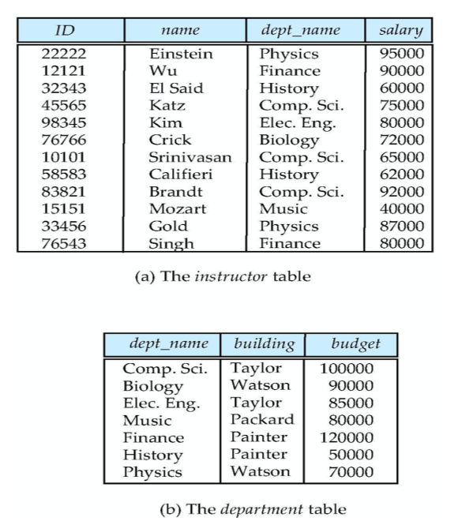
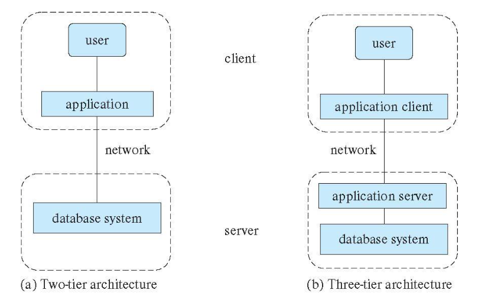

본 내용은 "Based on Database System Concepts - 7th Edition" 내용을 정리한 내용입니다.  

## 1. 데이터베이스(Database)란?
- - - 
체계적이고 조직적으로 정리된 전자식 또는 기타 수단으로 개별적으로 접근할 수 있는 독립된 저작물, 데이터 또는 기타 소재의 수합물을 말합니다.  

## 2. Database Applications Example
- - - 
  * Enterprise Information 
    + Sales: customers, products, purchases 
    + Accounting: payments, receipts, assets 
    + Human Resources: Information about employees, salaries, payroll taxes. 

  * Manufacturing: management of production, inventory, orders, supply chain. 

  * Banking and finance 
    + Customer information, accounts, loans, and banking transactions. 
    + Credit card transactions 
    + Finance: sales and purchases of financial instruments (e.g., stocks and bonds; storing real-time market data 

  * Universities: registration, grades

  * Airlines: reservations, schedules 

  * Telecommunication: records of calls, texts, and data usage, generating 
    + monthly bills, maintaining balances on prepaid calling cards 

  * Web-based services 
    + Online retailers: order tracking, customized recommendations 
    + Online advertisements 

  * Navigation systems: For maintaining the locations of varies places of 
    + interest along with the exact routes of roads, train systems, buses, etc.

## 3. 데이터 모델의 종류 (Data Models)
- - - 
  * A collection of tools for describing
    + Data (데이터)
    + Data relationships (데이터 관계)
    + Data semantics (데이터 의미)
    + Data constraints (데이터 제약)

  * Relational model (관계형 모델)
    + All the data is stored in various tables (모든 데이터는 다양한 테이블에 저장되어 있다.)
    
  * Entity-Relationship data model (mainly for database design) (엔티티-관계 데이터 모델)
  * Object-based data models (Object-oriented and Object-relational) (객체 지향 및 객체 관계)
  * Semi-structured data model (XML) (반 구조화된 데이터 모델)
  * Other older models:
    + Network model (네트워크 모델)
    + Hierarchical model (계층적 모델)

## 4. 인스턴스와 스키마 (Instances and Schemas)
- - - 
  * 프로그래밍 언어의 유형(Type) 및 변수(Variables)가 유사하다.
  * 논리적 스키마 (Logical Schema):  데이터베이스의 전체 논리적 구조
    + 예시: The database consists of information about a set of customers and accounts in a bank and the relationship between them
  * 물리적 스키마 (Physical Schema): 데이터베이스의 전체 물리적 구조
  * 인스턴스 (Instance) – 특정 시점에서 데이터베이스의 실제 콘텐츠 (변숫값과 유사)

## 5. 물리적 데이터 독립성 (Physical Data Independence)
- - -
  * 논리적 스키마를 변경하지 않고 물리적 스키마를 수정할 수 있는 기능
  * 애플리케이션은 논리적 스키마에 의존
  * 일반적으로 일부 부품의 변경이 다른 부품에 심각한 영향을 미치지 않도록 다양한 수준과 구성 요소 간의 인터페이스를 잘 정의해야 합니다.

## 6. 자료 정의 언어 (Data Definition Language - DDL)
- - - 
  * 데이터베이스 스키마 정의를 위한 사양 표기

## 7. 자료 처리 언어 (Data Manipulation Language - DML)
- - - 
  * 데이터베이스 관리 체계에 저장된 자료에 접근하고 조회하기 위해 대화 방식으로 사용하거나, 프로그래밍 언어 소스 코드에서 사용될 수 있는 SQL 문
  * DML의 2가지 유형
    + 절차적 DML (Procedural DML): 사용자가 필요한 데이터와 해당 데이터를 가져오는 방법을 지정
    + 선언적 DML 혹은 비절차적 DML (Declarative DML or Non-procedural DML): 사용자가 데이터를 가져오는 방법을 지정하지 않고 필요한 데이터를 지정하도록 요구

## 8. SQL 쿼리 언어 (SQL Query Language)
- - - 
  * SQL 쿼리 언어는 비절차적
  * 쿼리는 여러 테이블 (Possibly only one)을 입력으로 취하고 항상 단일 테이블을 반환합니다

## 9. 데이터베이스 설계 (Database Design)
- - -
데이터베이스의 일반적인 구조를 설계하는 과정
  * 논리적 설계 – 데이터베이스 스키마 결정
    + 데이터베이스 디자인을 할 때에 논리적인 솬계 스키마를 찾아야 합니다.
  * 물리적 설계 - 데이터베이스의 물리적 레이아웃 결정

## 10. 데이터베이스 엔진 (Database Engine)
- - - 
데이터베이스 시스템은 전체 시스템의 각 책임을 처리하는 모듈로 분할
데이터베이스 시스템의 기능적 구성 요소는 다음과 같이 나눌 수 있습니다.
  * 스토리지 관리자 (The storage manager)
    + Data file
    + Data dictionary
    + Indice
  * 쿼리 프로세서 구성 요소 (The query processor component): DDL interpreter / DML compiler / Query evaluation engine
    + 구문 분석 및 번역 (Parasing and translation)
    + 최적화 (Optimization)
    + 평가 (Evaluation)
  * 트랜잭션 관리 구성 요소 (The transaction management component)

## 11. 데이터베이스 애플리케이션 (Database Application)
- - - 
데이터베이스 응용 프로그램은 일반적으로 두 개 또는 세 부분으로 분할됩니다.
  * 2계층 아키텍처 (Two-tier architecture)
    + 애플리케이션은 클라이언트 머신에 상주하며 서버 머신에서 데이터베이스 시스템 기능을 호출
  
  * 3계층 아키텍처 (Three-tier architecture)
    + 클라이언트 머신이 프런트 엔드 역할을 하며 직접적인 데이터베이스 호출을 포함하지 않습니다.
  
  * 클라이언트 측은 애플리케이션 서버와 통신합니다.
  
  * 애플리케이션 서버는 차례로 데이터베이스 시스템과 통신하여 데이터에 액세스합니다.

## 12. 데이터베이스 관리자 (Database Administrator)
- - - 
A person who has central control over the system is called a database administrator (DBA)
  * Schema definition
  * Storage structure and access-method definition
  * Schema and physical-organization modification
  * Granting of authorization for data access
  * Routine maintenance
  * Periodically backing up the database
  * Ensuring that enough free disk space is available for normal operations, and upgrading disk space as required
  * Monitoring jobs running on the database and ensuring that performance is not degraded by very expensive tasks submitted by some users