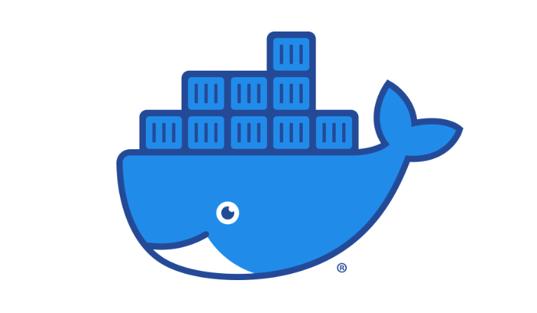

## 1. 도커란 무엇인가?
- - -
도커(Docker)는 리눅스 컨테이너에 여러 기능을 추가함으로써 어플리케이션을 컨테이너로서 좀 더 쉽게 사용할 수 있게 만들어진 오픈소스 프로젝트입니다.

## 2. 왜 도커를 써야하는가?
- - - 
원하는 개발 환경을 파일에 저장하면, 도커는 이를 내가 원하는 어떤 머신에 해당 환경을 시뮬레이션 할 수 있고 환경들은 각기 독립적으로 존재하기 때문에, 원하는 환경에서 모듈식으로 관리 가능합니다.
  * 어플리케이션의 개발과 배포 수월
  * 독립성 및 확장성 향상 

## 3. VM(Virtual Machine) vs 도커(Docker)
- - -

기존 가상화 기술은 하이퍼바이저를 이용해 여러 개의 운영체제를 하나의 호스트에서 생성해 사용하는 방식이었습니다. 하이퍼바이저에 의해 생성되고 관리되는 운영체제는 게스트 운연체제(Guest OS)라고 하며, 각 게스트 운영체제는 다른 게스트 운영체제와는 완전히 독립된 공간과 시스템 자원을 할당받아 사용합니다. 대표적으로 VirtualBox, VMware가 있습니다. 

반면, 도커는 프로세스 단위의 격리 환경을 만들기 때문에 성능 손실이 거의 없습니다. 컨테이너에 필요한 커널은 호스트의 커널을 공유해 사용하고, 컨테이너 안에는 어플리케이션을 구동하는 데 필요한 라이브러리 및 실행 파일만 존재하기 때문에 컨테이너를 이미지로 만들었을 때, 이미지의 용량 또한 가상 머신에 비해 현저히 적습니다. 

## 4. 도커 이미지(Docker Image)
- - -
도커 이미지는 서비스 운영에 필요한 서버 프로그램, 라이브러리 및 소스코드, 컴파일된 실행 파일을 묶은 형태라고 볼 수 있습니다. 즉, 어떠한 프로세스를 실행하기 위한 모든 파일과 환경을 지닌 상태입니다.

## 5. 도커 컨테이너(Docker Container)
- - - 
도커 컨테이너는 이미지를 실행한 상태로, 응용프로그램의 dependency와 함께 프로그램 자체를 패키징하여 격리된 공간에서 프로세스를 동작시킨 것입니다.

