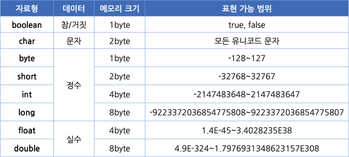

## 1. 변수란?
- - - 
어떠한 값을 저장하려면 저장할 공간이 필요한데, 이 공간의 이름이 바로 변수입니다.
변수를 사용하기 위해 어떤 형태의 자료를 저장할 것인지 정해야합니다. 예를 들어, 사람의 나이를 저장하려면 정수 형태를 써야 하고, 이름을 저장하려면 문자 형태를 써야합니다. 이 형태를 변수의 '자료형'이라고 합니다. 변수의 자료형을 선택했다면 변수의 이름도 정해줘야 합니다.


```
package java;

public class variable {
    public static void main(String[] args) {
        int level;      //int는 정수형, level은 변수명 = 정수형 변수 level을 선언
        level = 10;     //값 10을 Level 변수에 대입
        // or
        int level = 10; //level 변수 선언과 동시에 값을 대입(초기화)
        // 초기화 = 변수에 처음 값을 대입하는 것
    }
}
```

## 2. 변수 이름 정하기
- - - 
  * 변수 이름은 영문자(대문자, 소문자)나 숫자를 사용할 수 있고, 특수 문자 중에는 $, _만 사용할 수 있습니다.
    * g_level(O), count100(O), _master(O), $won(O)
  * 변수 이름은 숫자로 시작할 수 없습니다. 
    * 27days(X), 1abc(X)
  * 자바에서 사용하는 예약어(미리 약속되어 있는 단어)는 사용 할 수 없습니다.
    * while, int, break...

#### - 카멜 표기법
  * 변수의 이름은 대부분 소문자로 시작하며 여러 단어로 변수 이름을 만들 경우 중간에 다른 뜻의 단어가 등장할 때, 첫 글자를 대문자로 사용하는 것도 변수 이름을 알아보기 쉽게 만드는 요령입니다.


## 3. 자료형의 종류
- - - 
자바에서 제공하는 자료형은 기본 자료형과 참조 자료형이 있습니다. 기본 자료형은 자바 라이브러리에서 기본으로 제공하며, 얼마만큼의 메모리를 어떻게 사용할 것인지가 이미 정해져 있습니다.



#### 자료형이 다른 정수끼리 더하면 어떻게 될까요?
  * 프로그램이 실행되어 정수 값을 연산할 때, 4바이트를 기본 단위로 사용하기 때문에, 두 정수를 더하기 전에 두 정수는 모두 int형으로 반환되고 또한 더한 결과 값도 int형으로 저장됩니다.


## 4. 자료형 없이 변수 선언하기 (자바 10부터 생긴 문법)
- - - 
자바의 모든 변수를 사용할 때는 사용할 자료형을 정확히 명시해야 합니다. 즉 어떤 변수가 얼마만큼의 메모리를 사용하고 어떤 방식으로 그 값을 저장할지 자료형으로 선언해 주는 것입니다. 그렇지만 자바 10 부터는 자료형을 쓰지 않고도 변수를 사용할 수 있습니다. 이를 지역 변수 자료형 추론(Local variable type inference)라고 합니다. 변수에 대입되는 자료를 보고 컴파일러가 추측하여 알 수 있습니다.

```
var num = 10;               -->             int num = 10;                 
var dNum = 10.0;            -->             double dNum = 10.0;
var str = "hello";          -->             String str = "hello";
```

var를 사용하여 변수를 선언하는 방법은 자바스크립트 같은 다른 프로그래밍 언어에서 이미 사용하고 있습니다.
다만 자바에서 var를 사용할 때는 다음 사항을 유의해야 합니다.
  * 한번 선언한 자료형 변수를 다른 자료형으로 사용할 수 없습니다.
  * var로 자료형 없이 변수를 선언하는 방법은 '지역 변수'만 가능합니다. 


## 5. 상수 선언하기
- - - 
프로그램에서는 변수와 달리, 변하지 않는 수도 필요합니다. 항상 변하지 않는 값을 '상수(constant)'라고 합니다. 자바에서 상수는 다음처럼 final 예약어를 사용하여 선언합니다.

```
final double PI = 3.14;
final int MAX_NUM = 100;
```

프로그램 내부에서 반복적으로 사용하고, 변하지 않아야 하는 값을 상수로 선언하여 사용하면 좋습니다. 숫자로 표기하였을 때, 그 숫자가 달라지면, 코드 내부의 숫자를 전부 바꿔야 하지만 상수를 선언하면, 상수 선언 값만 바꿔도 되기 때문에 편리합니다.

## 6. 리터럴
- - -
리터럴(literal)은 프로그램에서 사용하는 모든 숫자, 문자, 논리 값(T/F)을 일컫는 말입니다. 리터럴은 프로그램이 시작할 때, 시스템에 같이 로딩되어 특정 메모리 공간인 상수 풀(constant pool)에 놓입니다.  
자바에서 정수를 표현하는 메모리의 기본 크기는 4바이트입니다. 하지만 long은 4바이트 크기에 들어갈 수 없기 때문에, 8바이트로 처리하라고 컴파일러에 알려줘야 합니다. 따라서 리터럴 뒤에 식별자 'l' or 'L'을 써주는 것입니다.  
마찬가지로 실수 리터럴은 double형, 즉 8바이트로 처리됩니다. float형은 대입이 되지 않아, 역시 식별자 'f' or 'F'를 써줘야합니다.

## 7. 형 변환
- - - 
정수와 실수는 컴퓨터 내부에서 표현되는 방식이 전혀 다릅니다. 따라서 정수와 실수를 더한다고 할 때 그대로 연산을 수행할 수 없고, 하나의 자료형으로 통일한 후 연산을 해야합니다. 이때 형 변환(type conversion)이 이루어 집니다.  
형 변환은 크게 묵시적 형 변환(자동 형 변환)과 명시적 형 변환(강제 형 변환) 두가지로 구별해서 생각할 수 있습니다. 형 변환의 기본 원칙은 다음과 같습니다.  
  1. 바이트 크기가 작은 자료형에서 큰 자료형으로 형 변환은 자동으로 이루어진다.
  2. 덜 정밀한 자료형에서 더 정밀한 자료형으로 형 변환은 자동으로 이루어진다.

### 묵시적 형 변환
  * 바이트 크기가 작은 자료형에서 큰 자료형으로 대입하는 경우
  ```
  byte bNum = 10;
  int iNum = bNum;  //byte형 변수 bNum 값을 int형 변수 iNum에 대입함
  ```
    + 이 경우 bNum의 크기는 1바이트이고 iNum의 크기는 4바이트이므로 자료 손실 없이 bNum에 들어 있는 값이 모두 iNum에 저장됩니다. 남은 3바이트에는 0으로 채워집니다.  

  * 덜 정밀한 자료형에서 더 정밀한 자료형으로 대입하는 경우
  ```
  int iNum2 = 20;
  float fNum = iNum2;
  ```
    + 이 경우에는 두 변수의 크기가 같은 4바이트라도 float형인 fNum이 더 정밀하게 데이터를 표현할 수 있으므로 실수형인 float형으로 변환됩니다.

  * 연산 중에 자동 변환되는 경우
  ```
  int iNum = 20;
  float fNum = iNum;
  double dNum;
  dNum = fNum + iNum;
  ```
    + 이 경우에는 dNum = fNum + iNum에서 두 번의 형 변환이 일어납니다.
    + 먼저 fNum + iNum 연산에서 int형이 float형으로 변환됩니다.
    + 두 변수를 더한 결과 값이 dNum에 대입되면서 double형으로 변환됩니다.
    + 이렇듯 바이트 크기가 작은 수에서 큰 수로, 덜 정밀한 수에서 더 정밀한 수로 자료형이 변환되는 경우에는 자동 형 변환이 일어납니다.


### 명시적 형 변환
묵시적 형 변환과 반대의 경우로 생각할 수 있습니다.
  * 바이트 크기가 큰 자료형에서 작은 자료형으로 대입하는 경우
  ```
  int iNum = 10;
  byte bNum = (byte)iNum;   //강제로 형을 바꾸려면 바꿀 형을 괄호를 써서 명시해야 합니다.
  ```
    + byte형은 1바이트로 int형보다 크기가 작기 때문에 자료 손실이 발생할 수 있습니다.
    + 따라서 변환할 자료형을 명시적으로 써 주어야 하며, 이를 강제 형 변환이라고 합니다.
    + 이 경우에는 대입된 값 10을 1바이트 안에 표현 할 수 있으므로 자료 손실이 없습니다.  

    ```
    int iNum = 1000;
    byte bNum = (byte)iNum;
    ```

      + 이 경우에는 값 1000이 byte형 범위(-128 ~ 127)를 넘기 때문에 자료 손실이 발생해 대입된 값이 -24로 출력됩니다.

  * 더 정밀한 자료형에서 덜 정밀한 자료형으로 대입하는 경우
    + 실수 자료형에서 정수 자료형으로 값이 대입되는 경우에도 역시 형 변환을 명시적으로 해주어야 합니다.

    ```
    double dNum = 3.14;
    int iNum2 = (int)dNum;  //실수 자료형 double을 정수 자료형 int로 형 변환
    ```

     + 이 경우에는 실수의 소수점 이하 부분이 생략되고 다음처럼 정수 부분만 대입됩니다.
