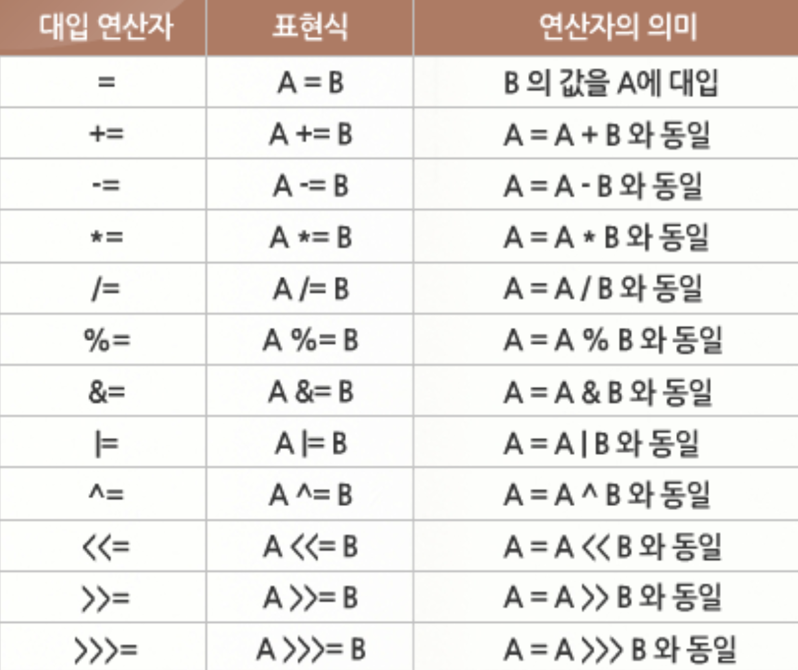
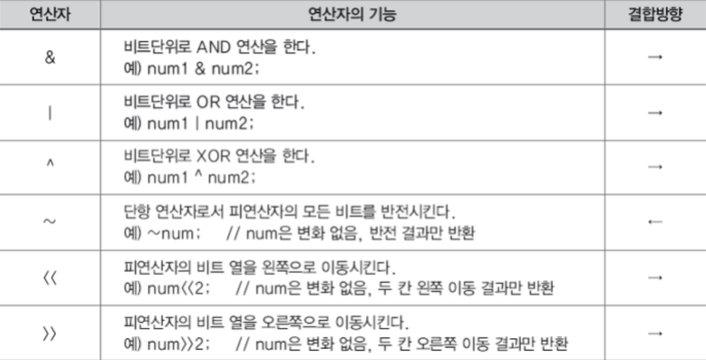
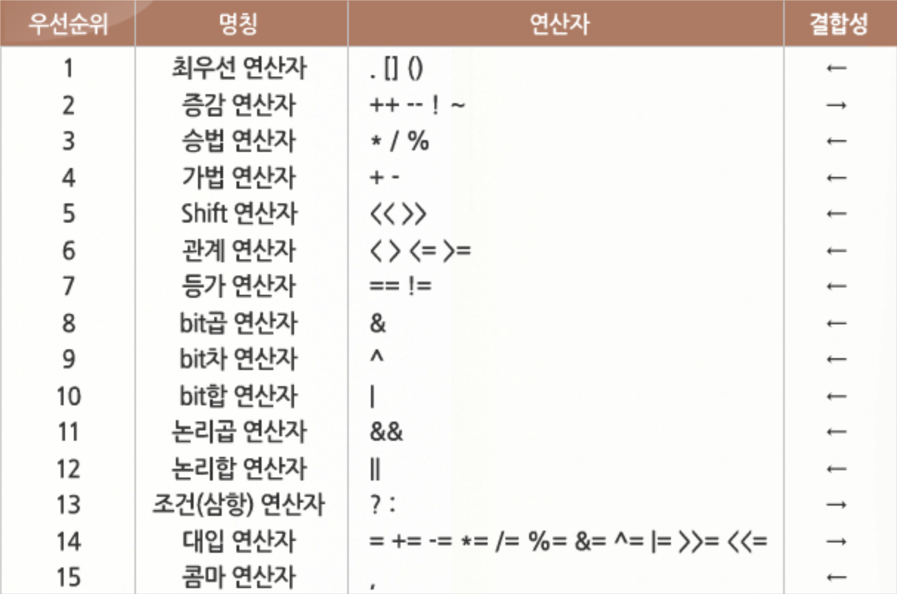

## 1. 항과 연산자
- - - 
연산에 사용하는 기호를 연산자(operator)라고 합니다. 그리고 연산에 사용하는 값을 항(operand)이라고 합니다. 연산자는 항의 개수에 따라 단항 연산자, 이항 연산자, 삼항 연산자로 나눌 수 있습니다.

  * 단항 연산자
    + 항이 한 개인 연산자  
    + ex) ++num

  * 이항 연산자
    + 항이 두 개인 연산자  
    + ex) num1 + num2;

  * 삼항 연산자
    + 항이 세 개인 연산자  
    + ex) (5 > 3 ? 1 : 0;)  
  
프로그램에서 사용하는 연산자는 우선순위가 있습니다. 단항 연산자가 가장 높고 이항, 삼항 연산자 순서입니다.  

## 2. 대입 연산자
- - - 
대입 연산자(assignment operator)는 변수에 값을 대입하는 연산자 입니다. 대입 연산자는 이항 연산자 중 우선순위가 가장 낮은 연산자입니다. 
```
왼쪽 변수 = 오른쪽 변수(또는 식)
int age = 24;   //나이를 의미하는 age 변수에 24를 대입함
totalScore = mathScore + engScore;  //mathScore과 engScore을 더하여 totalScore에 대입함
```
## 3. 부호 연산자
- - - 
부호 연산자는 +, - 두 가지가 있습니다. 더하기, 빼기 연산에 쓰는 이항 연산자이면서 부호를 나타내는 단항 연산자로도 사용합니다.  
```
package operation;

public class operationEX {
    public static void main(String[] args) {
        int num = 10;

        System.out.println(+num);   //10이 그대로 출력됨
        System.out.println(-num);   //-10이 출력되지만 num값은 변하지 않음
        System.out.println(num);    //10이 그대로 출력 됨

        num = -num;                 //num을 음수로 바꿔서 다시 num에 대입함
        System.out.println(num);    //-10이 출력됨
    }
}
```
## 4. 산술 연산자
- - - 
사칙 연산에서 사용하는 연산자가 산술 연산자입니다.
  * 더하기 (+)
    + 두 항을 더합니다.
  * 빼기 (-)
    + 앞에 있는 항에서 뒤에 있는 항을 뺍니다.
  * 곱하기 (*)
    + 두 항을 곱합니다.
  * 나누기 (/)
    + 앞에 있는 항에서 뒤에 있는 항을 나누어 몫을 구합니다.
  * 나머지(%)
    + 앞에 있는 항에서 뒤에 있는 항을 나누어 나머지를 구합니다.

산술 연산자의 우선순위는 일반 수학의 산술 연산과 같습니다. 나머지를 구하는 % 연산자의 우선순위는 *, / 연산자의 우선순위와 동일합니다.

## 5. 증가, 감소 연산자
- - - 
증가, 감소 연산자는 단항 연산자 입니다. 연산자 앞이나 뒤에 사용하며 값을 1만큼 늘리거나 1만큼 줄입니다.
  * ++
    + 항의 값에 1을 더합니다.
    ```
    val = ++num;    // 먼저 num 값이 1 증가한 후 val 변수에 대입
    val = num++;    // val 변수에 기존 num 값을 먼저 대입한 후 num 값 1 증가
    ```

  * \--
    + 항의 값에 1을 뺍니다. 
    ```
    val = --num;    //먼저 num 값이 1 감소한 후 val 변수에 대입
    val = num--;    //val 변수에 기존 num 값을 먼저 대입한 후 num 값 1 감소
    ```

## 6. 관계 연산자
- - - 
관계 연산자는 항이 두 개인 이항 연산자 입니다. 두 개의 항 중 어느 것이 더 큰지, 작은지, 같은지 등의 여부를 검사합니다.

  * \>
    + 왼쪽 항이 크면 참을, 아니면 거짓을 반환합니다.
  * \<
    + 왼쪽 항이 작으면 참, 아니면 거짓을 반환합니다.
  * \>=
    + 왼쪽 항이 오른쪽 항보다 크거나 같으면 참, 아니면 거짓을 반환합니다.
  * \<=
    + 왼쪽 항이 오른쪽 항보다 작거나 같으면 참, 아니면 거짓을 반환합니다.
  * \==
    + 두 개 항의 값이 같으면 참, 아니면 거짓을 반환합니다.
  * \!=
    + 두 개 항이 다르면 참, 아니면 거짓을 반환합니다.

  ```
  boolean value = (myAge > 25);     //가독성이 좋은 코드를 만들기 위해 괄호를 사용
  ```
## 7. 논리 연산자
- - - 
논리 연산자는 중학교에 배운 명제를 생각하면 됩니다. 두 명제가 모두 참이면 논리 곱은 참이고, 두 명제 중 하나만 참이면 논리 합은 참입니다. 참의 부정은 거짓, 거짓의 부정은 참입니다.
  * 논리 곱 (&&)
    + 두 항이 모두 참인 경우에만 결과 값이 참입니다.
    + 그렇지 않은 경우는 거짓입니다.
  * 논리 합 (\|\|)
    + 두 항 중 하나의 항만 참이면 결과 값은 참입니다
    + 두 항이 모두 거짓이면 결과 값은 거짓입니다.
  * 부정 (!)
    + 단항 연산자입니다.
    + 참인 경우는 거짓으로 바꾸고, 거짓인 경우는 참으로 바꿉니다.

  ```
  int num1 = 10;
  int num2 = 20;

  boolean flag = (num1 > 0) && (num2 > 0);
  System.out.println(flag);     //flag는 참

  boolean flag = (num1 < 0) && (num2 > 0);
  System.out.println(flag);     //flag는 거짓
  ```

## 8. 복합 대입 연산자
- - - 
복합 대입 연산자는 대입 연산자와 다른 연산자를 조합해 하나의 연산자처럼 사용하는 연산자입니다. 산술 연산자, 비트 연산자와 함께 사용하여 코드를 간결하게 표현할 수 있습니다.



## 9. 조건 연산자
- - - 
조건 연산자는 연산에 필요한 항의 개수가 세 개입니다. 그래서 삼항 연산자라고 합니다. 조건 연산은 주어진 조건식이 참인 경우와 거짓인 경우에 다른 결과 값이 나옵니다.
  * 연산자: 조건식 ? 결과1 : 결과2;
  * 기능: 조건식이 참이면 결과1, 조건식이 거짓이면 결과2가 선택됩니다.


## 10. 비트 / 이동 / 시프트(shift) 연산자
- - - 
비트 연산자는 비트 단위로 연산이 이루어지는 연산자입니다. 비트 단위의 연산을 하는 경우는 '암호화' 작업처럼 임의의 숫자를 만들거나, 어떤 변수의 특정 비트를 꺼내보는(마스킹; masking) 경우에 사용합니다. 혹은, 하드웨어에 내장되는 임베디드 시스템 프로그램에서 메모리 용량이 부족하거나 계산이 복잡해서 속도가 느려질 때, 곱셈이나 나눗셈을 비트 이동 연산자를 사용하면 어떤 수의 2배수, 4배수를 만들어 속도를 빠르게 할 수 있습니다.



## 11. 연산자 우선 순위
- - - 
연산자의 일반적인 우선순위는 다음과 같습니다.
  * 단항 연산자가 가장 높고 이항, 삼항 연산자 순서입니다.
  * 대입 연산자의 우선순위가 가장 낮습니다.
  * 산술, 관계, 논리, 대입 연산자 순서로 우선순위를 가지며 ()의 우선순위가 가장 높습니다.



